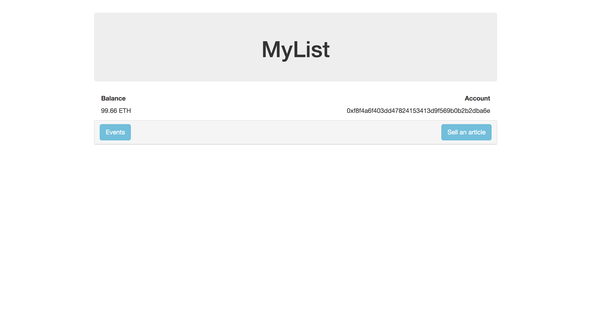
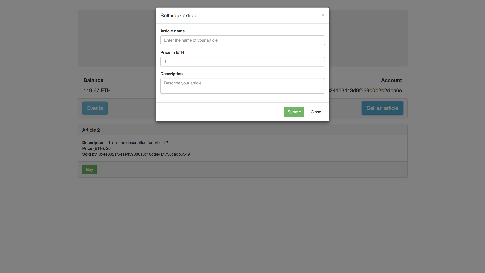
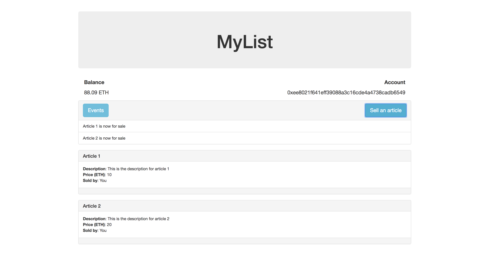
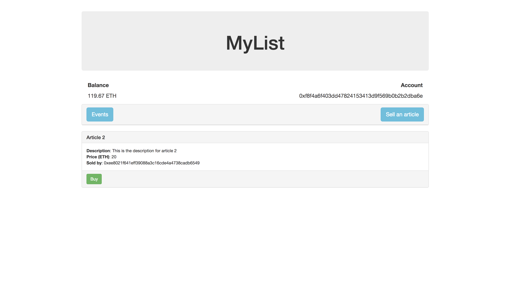

# MyList

## Description
DApp that manages articles. Ethereum accounts can post articles to be sold like Kijiji, and other accounts can purchase the article.

## Tools
Metamask and Genache where used during the testing process and the Truffle package was used to aid in the deployment of the smart contracts.

## Walkthrough
The inital view can be seen below.

The current account balance and number appear underneath the header. The events button collapses and expands a log of events.

Clicking the "Sell an article" button will cause a modal to appear asking for information on the article you wish to sell. An image of the modal can be seen below.

Once an account has enlisted an article to be sold it will appear in a list of articles. The image below is showing one account that has chosen to sell both article 1 and article 2. All of the necessary information for each article is seen in the article posting.

Once a new account visits the site they will see all of the available articles to be bought. The image below is showing the new account after having bought article 2.

